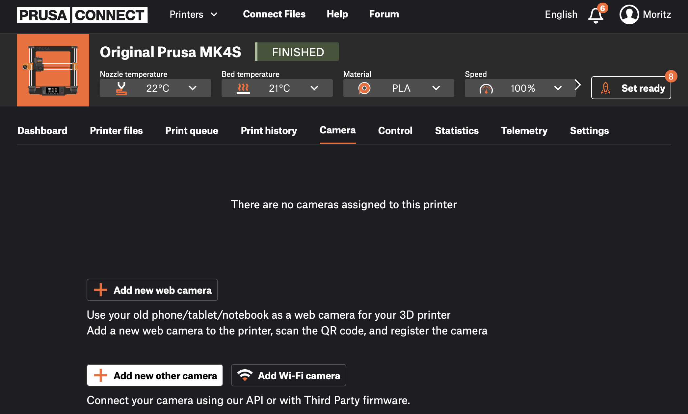
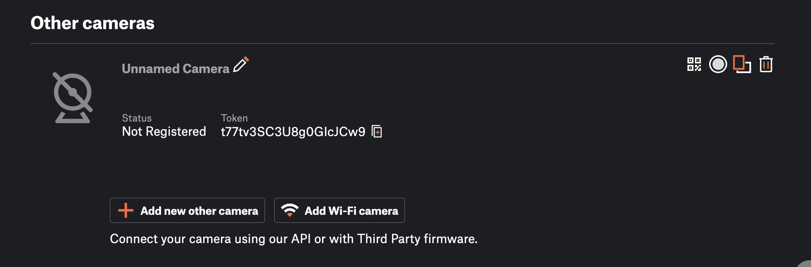

# PrusaConnect Camera Connector (PCCC)
  
This is a tool that periodically uploads camera images to PrusaConnect. It is designed to run on limited hardware (i.e. raspberry pi). 

> Please note that this tool is neither affiliated nor endorsed by Prusa in any way. 

## Prerequisites 

As it stands, this tool works on Linux and depends on `ffmpeg` being present and working. Since the camera capturing is relying on video4linux2, ffmpeg needs to be compiled with support for it. If you're on debian
    
    apt-get install ffmpeg 

should do the trick. 

## Getting Started 

Grab the [latest release from the release page](https://github.com/moritzh/prusaconnect-camera-connector/releases/latest) and unpack it. 

PCCC relies on a config file to work. The format is rather simple: 

```ini
interval=10 # that's seconds

[Camera0]
token=abcdefgh
fingerprint=randomuuid
device=/dev/video0

[Camera1]
token=123456
fingerprint=randomuuid2
device=/dev/video1
```

For every camera, you need to create a token from Prusa Connect. To do that, head over to [connect.prusa.com](https://connect.prusa.com), select the printer for which you'd like to add a camera and select "Add new other camera". 



Copy the token that appears and paste it into your config.



For fingerprint, you can use pretty much a random 20-character string, though using a UUID is probably safest. 

Simply run the command, it'll then periodically capture images and upload them. 

`./prusaconnect-camera-connector`

Notes: 
* The Section title in the config file doesn't matter. Can be [Camera0] or [Sunshine] or anything else. 
* The captured files are temporarily saved inside `/tmp`. 
* There's no command line options. Just use the config file. 

### Config File Location

The config file is loaded from `config.ini` (in the current directory) or `~/.pccc/config.ini`, in this order.

# License 

PCCC is licensed under the GPLv3, see LICENSE.